# OWND Project Whitepaper （ドラフト）

  - [1. イントロダクション](#1-イントロダクション)
    - [1.1 OWND Project の概要](#11-ownd-project-の概要)
    - [1.2 この Whitepaper の役割](#12-この-whitepaper-の役割)
    - [1.3 Trusted Webとの関係](#13-trusted-webとの関係)
  - [2. ビジョン、ミッション、コアバリュー](#2-ビジョン-ミッション-コアバリュー)
    - [2.1 未来に対するビジョン](#21-未来に対するビジョン)
    - [2.2 プロジェクトのミッション](#22-プロジェクトのミッション)
    - [2.3 コアバリュー](#23-コアバリュー)
  - [3. 現状認識と考慮事項](#3-現状認識と考慮事項)
    - [3.1 現状のデジタルアイデンティティ、コミュニケーション](#31-現状のデジタルアイデンティティ-コミュニケーション)
    - [3.2 新しいアプローチに対する考慮事項](#32-新しいアプローチに対する考慮事項)
  - [4. 課題の解決に向けて](#4-課題の解決に向けて)
    - [4.1 主な課題の特定](#41-主な課題の特定)
    - [4.2 OWND Projectの提案する解決策](#42-ownd-projectの提案する解決策)
  - [5. 提供する価値](#5-提供する価値)
    - [5.1 個人にとっての価値](#51-個人にとっての価値)
    - [5.2 企業にとっての価値](#52-企業にとっての価値)
    - [5.3 競争上の優位性](#53-競争上の優位性)
  - [6. ガバナンス構造](#6-ガバナンス構造)
    - [6.1 ガバナンスの考え方](#61-ガバナンスの考え方)
    - [6.2 OWND Project のガバナンス](#62-ownd-project-のガバナンス)
  - [7. 技術的アーキテクチャ](#7-技術的アーキテクチャ)
    - [7.1 技術選定](#71-技術選定)
    - [7.2 OWND Wallet のアーキテクチャ](#72-ownd-wallet-のアーキテクチャ)
    - [7.3 OWND Messenger のアーキテクチャ](#73-ownd-messenger-のアーキテクチャ)
    - [7.4 Trusted Web アーキテクチャとの関係](#74-trusted-web-アーキテクチャとの関係)
  - [8. ロードマップとマイルストーン](#8-ロードマップとマイルストーン)
    - [8.1 開発フェーズ](#81-開発フェーズ)
    - [8.2 マイルストーンとタイムライン](#82-マイルストーンとタイムライン)
  - [9. ユースケース](#9-ユースケース)
    - [9.1 年齢確認](#91-年齢確認)
    - [9.2 イベント参加証](#92-イベント参加証)
    - [9.3 デジタル社員証](#93-デジタル社員証)
  - [10. ビジネスモデルの検討](#10-ビジネスモデルの検討)
    - [10.1 秘密鍵管理/バックアップ/同期サービス](#101-秘密鍵管理バックアップ同期サービス)
    - [10.2 証明書発行インフラ提供](#102-証明書発行インフラ提供)
    - [10.3 メッセージングインフラ提供](#103-メッセージングインフラ提供)
  - [11. 結論と参加への呼びかけ](#11-結論と参加への呼びかけ)
    - [11.1 ホワイトペーパーの要約](#111-ホワイトペーパーの要約)
    - [11.2 プロジェクトへの参加への呼びかけ](#112-プロジェクトへの参加への呼びかけ)

## 1. イントロダクション
### 1.1 OWND Project の概要

OWND Projectは個人が主体となるデジタルアイデンティティーの社会実装を目指し、よりトラストできるコミュニケーションを実現するためのプロジェクトです。

ユーザ自身が自らのアイデンティティを管理し、属性情報を他者と相互検証できるようにした上で、特定のサービスに依存しないよう、相互運用性を確保したデータのやりとりや安全なメッセージングを行うことができるようにすることで、コミュニケーションのトラストを向上させることを目指します。

> トラストとは
> 事実の確認をしない状態で、相手先が期待したとおりに振る舞うと信じる度合い（Trusted Web において定義されている「Trust」を踏襲）

#### 1.1.1 このプロジェクトでやること

* 実現に資するオープンソースソフトウェアの開発
* トラストを担保するためのガバナンスモデル/ルールの検討
* ユースケース/ビジネスモデルの検討

#### 1.1.2 このプロジェクトでやらないこと

* プロジェクトとしての営利目的の活動は行わない
* このプロジェクトの成果物を利用した営利目的の活動は妨げない

### 1.2 この Whitepaper の役割

この Whitepaper は OWND Project のビジョン等を表明し、その役割と方向性を定義づける、プロジェクトのガバナンスの基礎となるものです。

OWND Project は、この Whitepaper に基づいて運営され、OWND Project 参加者は、別途定める [Code of Conduct](https://github.com/OWND-Project/contributing/blob/main/code-of-conduct.md) に従って、会議への参加や開発等によりコントリビュートすることができます。

ガバナンスの詳細は 6. ガバナンス構造 において説明しています。

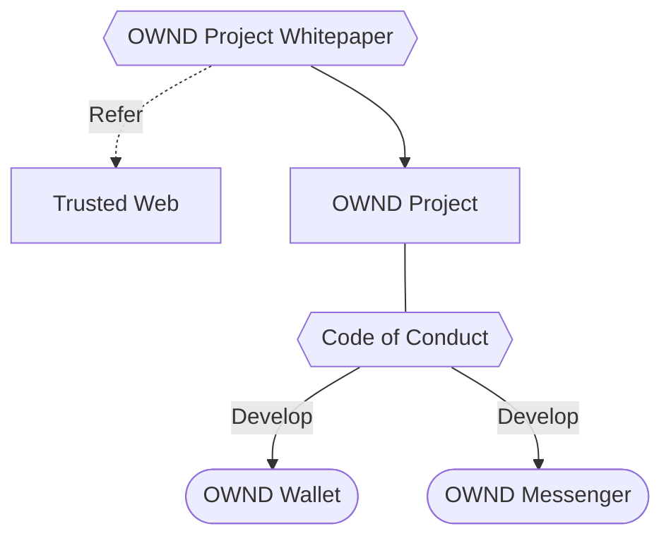

### 1.3 Trusted Webとの関係

OWND Project は、内閣官房デジタル市場競争本部の推進する["Trusted Web"](https://trustedweb.go.jp/)のユースケース実証事業の一部として誕生しました。

ユースケース名：[ウォレットによるアイデンティティ管理とオンラインコミュニケーション](https://trustedweb.go.jp/news/yqrxm6-b28v)

OWND Project は Trusted Web の概念を継承しますが、独立したプロジェクトであり、Trusted Webに依存しない持続可能なプロジェクトを目指します。

## 2. ビジョン、ミッション、コアバリュー

### 2.1 未来に対するビジョン

個人が主体となるデジタルアイデンティティーの社会実装を目指し、よりトラストできるコミュニケーションを実現する

### 2.2 プロジェクトのミッション

ユーザ自身が自らのアイデンティティを管理し、やるとりされるデータを相互に検証できるようにした上で、特定のサービスに依存しないよう、相互運用性を確保したデータのやりとりや安全なメッセージングを行うことができるようにする

### 2.3 コアバリュー

オープンに議論を行い、成果物を公開することで透明性を確保し、誰でも自由に参加でき、誰も排除せず、弱い立場にある人を取り残さないようにする

## 3. 現状認識と考慮事項

### 3.1 現状のデジタルアイデンティティ、コミュニケーション

#### 3.1.1 プラットフォームへの依存

現状、デジタルアイデンティティの管理は大手プラットフォームに依存、集中しています。例えば、オンラインで提供されるさまざまなサービスを利用する際には、プラットフォームの提供するアカウントを利用して、サインアップを行うことが一般に行われています。

Facebookログイン等のソーシャルログイン機能だけでなく、Gmail等のメールアドレス、Apple ID等のモバイルデバイスを利用するためのアカウントを通じ、大手プラットフォームがデジタルアイデンティティを管理しているため、例えばこれらのプラットフォームからアカウントの停止やBANをされることは、それらのプラットフォームサービスが運営しているサービスが利用できなくなるだけでは無くデジタルアイデンティティが剥奪されることと同義です。
例えば、GmailからアカウントBANをされてしまうと、Googleの提供するサービスを利用できなくなるだけでなく、Gmailのメールアドレスを利用したその他のサービスのアカウントへのアクセスも制限されることとになり、モバイルデバイスも利用が制限される状況になります。

さらに、年齢や性別、興味関心といった属性情報が要求された際には、ユーザーにはその正確性を保証したり、権利を確実に行使する手段が無く、プラットフォームのポリシーやアルゴリズムによる判断に委ねられ、プラットフォームの提供するビジネス機能（ターゲティング広告等）を通じてそれらの情報を他企業が利用する場合においても、ユーザー側には十分な透明性やコントローラビリティが確保できているとは言えません。また、利用する企業側においても、これらの属性情報の正確性を検証したり、ユーザーから適切に許諾等を得ているかを検証することはできず、プラットフォームに依存するしかない状況になっています。

#### 3.1.2 プライバシー

また、プラットフォームに対して多くの市民および企業が依存することで、プラットフォームには膨大な量の多種多様なデータが蓄積され、また蓄積されたデータを用いて、各個人の詳細なプロファイルを作成することができ、またAIの学習データとして利用されています。

大手プラットフォームは、これらの優位性を利用した個人に対する精細なマイクロターゲティングを可能にし、また第三者がこれらのデータをビジネスに活用できるようなエコシステムを構築することで莫大な収益を生んでいます。

個人が自分に関するどのようなデータが収集・蓄積され、どのようにプロファイリングされているかの実態を把握することは難しく、また、それらのデータが誰に、どのように利用され、利用された結果、自らにどのような影響が及ぶのかを想像することすら難しい状況です。

特に、プラットフォームが提供する識別子（メールアドレスやSNSのID、電話番号など）を用いた認証に依存していることにより、容易に企業を跨いだ名寄せができてしまうことで、ターゲティング広告に用いられるだけでは無く、多くの企業が独自にプロファイリングを行い、ユーザーの意図しない利用方法で用いられることにより、ユーザーの権利利益に大きな影響を及ぼしています。

また、SNSサービスやメッセージングサービスにおいては、利用者の電話帳をアップロードさせる機能により、本人の意思に関わらず、自身の電話番号が第三者によってアップロードされ、登録時に、自動的に友達登録が行われる機能等に利用されており、このネットワーク効果を利用するプラクティスはTelegramやSignalのようなプライバシーを重視すると謳っているサービスでさえも用いています。

#### 3.1.3 コミュニケーションにおける検証可能性

さらに、メールやメッセージングサービス、SNSにおいて、その相手方や相手方の属性情報、メッセージ自体を検証することができないため、スパムメールや詐欺SMS、詐欺広告、有名人の偽アカウント、偽広告などが横行しています。
例えば、OWND Project のメンバーが、`ota[at]datasign.com` というメールアドレスからメールを受け取ったとすると、OWND Project で事務局をしている株式会社DataSignの代表取締役をしている太田祐一さんからのメールであると勘違いすることは容易に想像ができます。
実際には `datasign.com` は株式会社DataSignが管理しているドメインでは無いですが、それを確認することは難しく、また逆に `datasign.jp`が本当に株式会社DataSignの管理ドメインなのか、ということを確認することも簡単ではありません。

これは、FacebookやX、LINE等のSNS、メッセージングサービスにおいても同様であり、Facebookで特定の有名人のアカウントであることを表明していたとしても、それが本当にその有名人のアカウントであることは、簡単に検証することができません。

このように、コミュニケーションの相手方や相手方の属性情報が検証できないことにより、SNSにおいては、有名人アカウントを装った詐欺広告が横行し、実際に投資詐欺にあう事例も増えており、取引先のメールアドレスを装った標的型攻撃は甚大な経済的な被害を与えています。

### 3.2 新しいアプローチに対する考慮事項

上記の課題を解決することを期待されているデジタルアイデンティティウォレットを用いたアイデンティティの管理は、一部地域での社会実装が進んでいますが、米国の一部の州におけるモバイルドライバーズライセンス（mDL）の運用状況を観察してみると、課題の一部は解決しているものの、特定のウォレット提供事業者に依存してしまうことで相互運用性が担保されていないケースや、運転免許証発行者に都度問い合わせを行うアーキテクチャを採用してしまうことで、市民の行動が州政府に把握されてしまうような、プライバシーに関する問題が指摘されているケースなどが散見されています。

欧州においては、eIDAS2によりEU各国に義務付けられる予定の European Digital Identity Wallet の実装について、相互運用性を確保し、特定の事業者に依存しないようなトラストフレームワークが構築されつつありますが、採用されている技術的な問題によって、第三者による名寄せが可能になってしまうことについては問題定義がなされています。

また、デジタルアイデンティティウォレットを用いて、アイデンティティの管理を行ったとしても、コミュニケーションの手段として、既存のサービス（大手プラットフォームの提供するメールやメッセージングサービス、SNS）を利用することは、結局プラットフォームの提供するアイデンティティに依存してしまうことになります。

したがって、OWND Project では、標準化されたプロトコルに基づく検証可能なデータのやり取りを実現し、特定の事業者に依存しないアーキテクチャを採用することで、相互運用性を確保し、プライバシーに対する課題についても高度に解決し、個人が主体となるデジタルアイデンティティを用いた、よりトラストできるコミュニケーションのエコシステムの構築を目指す必要があります。

## 4. 課題の解決に向けて

### 4.1 主な課題の特定

#### 4.1.1 不透明なデータの収集と利用

企業は生活者と効率的にコミュニケーションを行うために、生活者のさまざまなデータを収集することはマーケティング活動の一環として、広く普及しており、特に行動の履歴やその識別子として利用されるメールアドレスや電話番号はメールマーケティングやSNSマーケティング等における顧客獲得にも利用されています。
一方でそれらのデータ収集や利用について、生活者はその実態を把握しているとは言えず、メールアドレスやSNSのID等の事業社を跨いで名寄せができる識別子を簡便に取得できるソーシャルログインや、ソーシャルプラグインなどを利用している事業者から、意図せず自身に関する情報がプラットフォームに集約されることは、生活者の意図しない結果をもたらすことがあることは、ケンブリッジアナリティカ事件やリクナビ内定辞退率問題においても指摘されてきました。

また、収集されたデータが漏洩したり、身に覚えのない第三者への提供が行われることにより、メールやSMSを用いたフィッシングサイトへの誘導や、スパムメール、スパムSMSなどが横行し、生活者は辟易しています。

#### 4.1.2 煩雑なデータのやりとり

オンラインにおいて本人確認を行おうとする場合、運転免許証の画像をアップロードし、カメラに向けて顔を上下左右に動かし、アップロードされた画像や動画を人間が確認して本人の確認を行う、ということは広く行われており、生活者として面倒だと思ったことがある方は多いと思います。

また面倒である、ということだけでなく、例えば必要な情報が「20歳以上」という情報だけだとした場合、運転免許証に記載されている氏名・生年月日・性別・住所・顔写真は必要のない情報になり、不要な情報を渡すリスクや企業側での管理コストの増大にもつながっています。

また、BtoB領域においては現在もメールが企業間におけるオンラインでのコミュニケーションの主流となっていますが、メッセージの内容が通常では暗号化されていないことにより、PPAPと呼ばれるパスワード付きzipファイルを添付しパスワードを別送するという、送り手側も受け手側も面倒で煩雑な、かつ安全性も担保されていない方法が多くの企業でのデータのやりとりで運用されています。

昨今、上記のメールにおける課題を一部解決する法人向けコラボレーションツールなどは普及していますが、各社が、各個別の特定の事業者に依存しており、特に法人を跨ぐメッセージングにおいては、Slack, Teams, Discord, Chatwork等複数のツールを常に確認するという煩雑さだけでなく、担当者が個人レベルで業務に利用してしまうシャドウITも問題になっています。

また、コミュニケーションの相手方を検証できないことにより、現状認識の章でも述べた標的型攻撃には簡単に対処することができず、メールを開かないようにしたり、別途ウイルス対策ソフトでスキャンをするなどの対策が必要です。

#### 4.1.3 NASCAR問題

また、多くのオンラインサービスでは、アカウント登録の方法として、メールアドレスや電話番号での認証に加え、プラットフォームの提供するアカウントの認証情報を利用した登録の方法を導入しています。
これは一定の利便性を提供しているように見えますが、プラットフォーム各社が同様の機能を提供することにより、オンラインサービスのアカウント登録画面には、複数のプラットフォームのロゴが並ぶ状況になっており、利用者は登録する際にどの方法でアカウントを登録するかを迷わせ、また、登録した後、ログインをする際には、どの方法でアカウントを作ったのかを覚えている必要があるという課題があります。

プラットフォームからアカウントがBANされた場合に、そのサービスにログインできなくなることは、3. 現状認識と考慮事項のセクションで触れたとおりです。

### 4.2 OWND Projectの提案する解決策

オンラインでのコミュニケーションサービスはインフラとして必要とされる一方、これまで述べてきたように多くの課題が指摘されています。OWND Projectでは、これらの課題を解決すべく、`OWND Wallet` と `OWND Messenger` の二種類のシステムを開発します。
これらのシステムを商用利用も可能なオープンソースコードとして公開することで、誰でもこれらの実装やソースコードを用いたサービス提供ができるようにします。
OWND Wallet や OWND Messenger 自体が普及することを目指すのではなく、これらのソースコードが多くの人や企業に利用されることで、OWND Wallet、OWND Messengerをベースとした、特定の事業者に依存することない、相互運用可能な、さまざまデジタルアイデンティティウォレットやそのユースケース、メッセージングサービスが創出されることで、現在の社会における課題を解決し、多くの人にその効果が及ぶことを目指します。

#### 4.2.1 OWND Wallet

ユーザが自身のアイデンティティを管理でき、自分の意思で相手先に検証可能なデータを受け渡すことのできる汎用的なデジタルアイデンティティウォレットを国際標準仕様に準拠して開発し、オープンソースプロジェクトとして既存のコミュニティと連携しながら社会実装・普及を目指すことにより、さまざまなユースケースで利用でき、かつ相互運用可能なデータのやりとりの実現し、特定の事業者に依存しない、誰でも開発し利用できるデジタルアイデンティティウォレットの構築を目指します。

* **現時点で予定している開発物**
    * OpenID for Verifiable Credential Issuance（OID4VCI）の Holder側実装
    * OpenID for Verifiable Presentations（OID4VP）の Holder側実装
    * Self-Issued OpenID Provider v2（SIOPv2）の Holder側実装

#### 4.2.2 OWND Messenger

デジタルアイデンティティウォレットにおいて管理するアイデンティティを用いて、自身の検証可能な属性情報を受け渡し、メッセージの相手方の属性の検証も行うことのできる、End-to-End暗号化に対応したメッセージングプロトコルを開発し、オープンソースとしてコードを公開することで、誰もが相互運用可能なメッセージングサーバを構築することができるようにすることで、誰もが安心して利用できるようなメッセージング基盤の構築を目指します。

* **現時点で予定している開発物**
    * プロトコルには Matrix を採用
    * サーバーサイドは Synapse にSIOPv2、OID4VPおよび各種証明書へ対応するためのを機能を追加実装
    * クライアントサイドは Element Web にSIOPv2、OID4VPおよび各種証明書へ対応するためのを機能を追加実装

#### 4.2.3 その他

上記のほか、OWND Walletに格納する証明書とその発行を行うためのコード、OWND Messengerで証明書を受け取るために必要な以下のコードを開発します。

* **現時点で予定している開発物**
    * Selective Disclosure for JWTs（IETF SD-JWT VC）証明書
    * mdoc (ISO 18013-5) 証明書
    * JSON-LD ZKP with BBS+ 証明書
    * OpenID for Verifiable Credential Issuance（OID4VCI）の Issuer側実装
    * OpenID for Verifiable Presentations（OID4VP）の Verifier側実装
    * Self-Issued OpenID Provider v2（SIOPv2）の Verifier側実装

## 5. 提供する価値

### 5.1 個人にとっての価値

#### 5.1.1 データ収集の透明化と不正な利用の防止

OWND Walletによってアイデンティティの管理を自身で行うことができるようにすることで、どの情報を誰に提供するかを自分自身で判断できるようになるため、企業による不透明なデータ収集や、プラットフォームによる意図しないデータの収集や利用を防止することが可能になります。また、識別子を提供先毎に変更することにより、名寄せのリスクも低減させることができ、相手先からメッセージを受け取る必要がある場合においても、OWND Messengerを利用することでメールアドレスや電話番号が必要ではなくなることから、それらの情報の漏えいも防ぐことができ、スパムメールや詐欺SMSの被害も低減され、安心して、自分のデータを開示することができるようになります。

#### 5.1.2 データのやりとりにおける利便性

やりとりされるデータを選択的な開示ができる検証可能な証明書にし、OWND Walletに格納することで、「20歳以上である」という情報のみを相手先に渡すことができるようになるため、面倒な作業を行わずに自分の属性を相手先に提示し、簡単に証明することが可能になります。また受け取った相手方も簡単に属性の検証ができるようになることで、データのやり取りがシンプルになります。
またデータを渡す相手先を検証できるようになることから、フィッシングではないことを確認することも簡単に行うことができるようになります。

また、共通のメッセージングプロトコルを利用することで、メッセージングサービス同士の相互運用性が担保され、各個人が自分の嗜好に応じたサービスを主体的に選択することが可能になります。

#### 5.1.3 NASCAR問題の解消

サービス提供事業者がSIOPv2に対応することで、OWND Walletだけでなく、SIOPv2に対応したデジタルアイデンティティウォレットであれば、なにを用いていたとしても、アカウント登録やログインを行うことができるようになります。認証に使うプラットフォームを選んだり、覚えておく必要もなくなり、プラットフォームからBANされてしまうことにより、オンラインサービスが使えなくなってしまうこともありません。

### 5.2 企業にとっての価値

#### 5.2.1 データの収集と利用目的の明確化

デジタルアイデンティティウォレットから検証可能な属性情報を、利用目的を明確にしたうえで、必要最小限の項目のみ受け取ることは、企業にとってもメリットがあります。本人確認書類の画像や本人の動画を管理し、それを人の目で確認するコストを削減するだけでなく、法令順守の観点からもOECD8原則、特に「目的明確化の原則」「利用制限の原則」「収集制限の原則」に則った運用が簡単になります。また、これらの原則に対応することで生活者の信頼を獲得することにもつながります。

#### 5.2.2 データのやりとりの利便性
本人確認書類の送付等の面倒な作業を利用者に課すことがなくなるため、利用希望者に対してシームレスにサービスが提供できるようになります。また、属性情報の検証コストが低くなることで、これまで厳密に検証できなかった年齢や性別などの確認についても簡便に行えるようになり、サービスの品質を維持しやすくなります。

また、特にBtoB領域においては、OWND Messengerでは、End-to-End暗号化を有効にすることが可能なため、メッセージや添付ファイルの送付を面倒な作業を行うことなく安全に送信することができます。
さらに、共通のメッセージングプロトコルを利用することで、メッセージングサービス同士の相互運用性が担保され、各企業が導入をしているサービス間のメッセージングも可能になり、複数のサービスを常に確認するといった煩雑な作業や、シャドウITを防ぐことにもつながります。

#### 5.2.3 NASCAR問題の解消
メールアドレス・電話番号による認証、各社のプラットフォーム認証など、複数の認証方法に対応する必要がなくなり、UX/UIの観点においても、登録時の選択肢を減らし、ログイン時に迷うことも無くなることは企業にとって大きなメリットです。またプラットフォーム各社の仕様の変更に合わせた開発もなくなり、また企業側がプラットフォームからBANをされてしまうことにより、特定のプラットフォームの認証を用いている利用者を失うこともありません。

### 5.3 競争上の優位性

デジタルアイデンティティウォレットを用いたVCデータモデルのデータのやりとりの利点はこれまで述べてきた通りですが、しばしば従来のサーバ集中型の認証・認可システムでも実現可能であるとの指摘があります。本セクションではそれらのシステムに対するVCデータモデル（OWND Projectの開発技術を利用）の優位性を「18歳以上確認」のケースをもとに説明します。

従来のサーバ集中型の認証・認可システムを用いて18歳以上の確認を行うためには、まず18歳以上の証明を行うサーバを構築し、第三者に向けたAPIを開放する必要があります。そして、18歳以上を確認したい事業者はそのAPIと接続するシステムを構築し、利用者に対する18歳以上の確認を行うたびに、サーバ側へのアクセスを行う必要があります。また、その都度、サーバ側では、国民全員分のデータベースを検索し、結果を返却必要があります。

1. 18歳以上の証明を行うサーバを構築

    従来型では、18歳以上の確認を行うたびにデータベースへのアクセスが発生するため、効率化のために既存の国民全員分のデータベースに対し、18歳以上を判定するBoolean型のカラムを追加することが必要になりますが、VCデータモデルでは必ずしもその必要はありません。VCデータモデルではVCを発行するときに1回計算すれば良いため、既存の生年月日カラムから都度計算する方法でも効率が悪化するとは考えにくいです。

1. 第三者に向けたAPIを開放

    従来型では、18歳以上を確認したい第三者がAPIを利用することになるため、APIを設計しますが、国民全員のデータベースへのアクセスを一般公開することは難しいため、認可された第三者のみがそのAPIを利用できるような、API利用者管理システムを構築する必要があります。また、そのAPI利用者を管理するための運用コストは莫大になり、18歳以上APIを利用する事業者も申請や認可などの手続きを嫌がります。VCデータモデルでは、既存の認証システムに対し、VCを発行する機能のみを追加すれば良く、新たなAPIを第三者に向けて開放する必要はありません。また、18歳以上を確認したい事業者もVCデータモデルのガバナンス上の手続きのみで18歳以上の確認を行うことができます。

1. 18歳以上を確認したい事業者がそのAPIと接続するシステムを構築

    従来型では、APIの仕様に合わせた確認側の開発が必要になりますが、VCデータモデルでは、OID4VPの仕様に準拠していれば、18歳以上のVC（VP）を受け取ることができます。一点、18歳以上を表現するためのスキーマ定義は事前に合意する必要はあります。

1. 確認を行うたびにサーバ側へのアクセスが発生

    従来型では、確認を行うたびにサーバ側へのアクセスが発生するため、アクセス数に応じたサーバのキャパシティの増強が必要になりますが、VCデータモデルでは、VCを発行するときに1回利用者からアクセスがあるだけのため、既存のキャパシティのままでも対応できると考えられます。（公開鍵へのアクセスが発生することが考えられるが、単純なテキストファイルへのアクセスのため無視できる）
    また、従来型では誰が、どの事業者によって18歳以上を確認されたか、という情報がサーバ側に蓄積されることにもなります。

このように、VCデータモデルでは、大規模なシステムであるほどシステム構築コスト・運用コストの削減メリットが期待でき、制度運用のための面倒な申請制度も簡略化できることから、社会実装を行う際のハードルが低く、また、利用者に対するプライバシーインパクトも低減することができる方式と言えます。

ただし、VCデータモデルにも課題があります。例えば、証明書の有効性確認は従来型に比べて課題になると考えられます。従来型では、都度、国民の最新情報が保存されているサーバにアクセスすることで常に最新の情報を取得することが可能ですが、VCデータモデルでは上記の優位性を最大限活用しようとする場合に、証明書の有効性確認においてはトレードオフが発生します。「18歳以上」というような、一度発行してしまえば死亡するまでは有効だと考えられる証明書では大きな問題にはなりませんが、更新が必要な資格証明書や、在籍証明書などを運用する際には、考慮が必要となります。

## 6. ガバナンス構造

### 6.1 ガバナンスの考え方

OWND Projectのガバナンスは、OWND Projectの活動、公開するソースコードおよび提供するアプリケーションが、この Whitepaper の内容に沿って運用されていることを担保するために以下の原則に基づいて構築されます。

* **透明性**
    * 意思決定プロセスと、プロジェクトに関わる文書は公開されることで、透明性が担保されます。

* **多様なステークホルダーによるコンセンサス**
    * 参加者を排除しないことにより、多様なステークホルダーによるコンセンサスを形成することで意思決定を行います。

OWND Projectのガバナンスは、他のエンティティにおける成果物の利用に関しては、現時点では対象としませんが、その利用がOWND Projectの理念に適合しているかを評価する枠組みを将来的に提供する可能性を残しています。

#### 6.1.1 ガバナンスによって防ぎたいこと

* **Whitepaper**
    * Whitepaper が、現在の Whitepaper の内容に反して改変が行われる
    * 関係のないプロジェクトがOWND Projectを標榜する

* **Code of Conduct**
    * Code of Conduct が Whitepaper の内容に反して改変が行われる
    * 参加者が Code of Conduct に従わない

* **ソースコード**
    * 公開したソースコードが準拠を謳っている標準規格に従っていない
    * マルウェア等がソースコードに紛れ込む

* **アプリケーション**
    * 公開したソースコードと、提供するアプリケーションの挙動が一致しない
    * 提供するアプリケーションが Whitepaper の内容に沿って運用されていない

### 6.2 OWND Project のガバナンス

OWND Project におけるガバナンスについて以下に概念図を示しました。ガバナンスを有効に働かせるためのトラストフレームワークは別途、制定するものとします。

OWND Projectのガバナンスは、Trusted Web、OpenID Foundation、Matrix.org Foundationなどの外部コミュニティと連携し、それらのトラストフレームワークに準拠することで、強化されます。

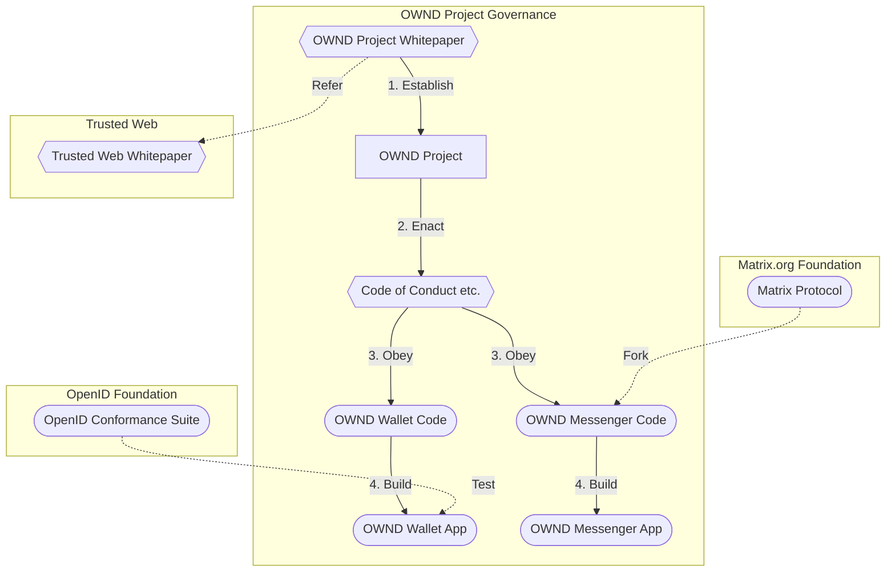

1. Establish

    OWND Project は OWND Project Whitepaper によって成立するプロジェクトであり、このホワイトペーパーが公開され、OWND Projectの活動自体も公開されることにより、ガバナンスが機能します。

1. Enact

    OWND Projectへのコントリビューションに際し、Code of Conduct等のルールを制定します。
    Code of Conduct 等のルールは OWND Project の参加者によって制定、公開されます。

1. Obey

    参加者は Code of Conduct 等のルールに従って、会議への参加や、コードの開発を行います。
    ソースコードは当然公開されますが、会議の議事録や技術選定理由等もできる限り公開されることにより、ガバナンスが機能します。

1. Build

    公開されたソースコードからアプリケーションとしてビルドして提供します。
    OWND Project により承認された開発者がビルドしシステムを提供していることを証明します。

## 7. 技術的アーキテクチャ

### 7.1 技術選定

OWND Project において利用する技術の選定においては、以下の方針に照らし合わせて選定を行いました。

* 信頼できる国際標準技術を用いて、特定の団体、プラットフォーム、暗号資産等にできるだけ依存しない。
* [European Digital Identity Architecture and Reference Framework](https://github.com/eu-digital-identity-wallet/eudi-doc-architecture-and-reference-framework/blob/main/docs/arf.md)で利用されるプロトコルとして参照されている、[OpenID for Verifiable Credentials](https://openid.net/sg/openid4vc/)が定める3仕様に準拠することを念頭に、それと整合した技術を用いる。

##### 選定対象の技術要素

* 証明書形式
* Issuer識別子
* Holder識別子
* Verifier識別子
* 証明書伝送プロトコル
* メッセージングプロトコル
* Issuerの信頼性担保
* 秘密鍵管理/リカバリ
* 開発言語

各要素の技術選定における観点や選定結果については、[利用技術選定](https://docs.google.com/spreadsheets/d/1slgnsy94R3Ku3SEJPddlYciZ1bIDZcU2sHR8cSuSP-4/edit#gid=870253557)シート（Google Sheets）をご確認ください。

### 7.2 OWND Wallet のアーキテクチャ

##### 各エンティティの役割

* Certificate Authority

    IssuerおよびVerifierの信頼性担保のためにIssuerとVerifierに対して証明書を発行します。

* Issuer

    Holderの認証を行い、Holderに対し、Holderの何らかの属性を証明するための Verifiable Credentials（VC） を発行します。
    IssuerはVCを発行するためのシステムを保持しています。

* Holder

    IssuerからVCを発行してもらい、Verifiable Presentation（VP）を作成し、自分の属性を証明したい相手（Verifier）に提示します。
    HolderはIssuerからVCを受け取り、VPをVerifierに提示するためのWalletを保持しています。
    また、Verifier（サービスプロバイダ）に対しアカウントの発行を行ってもらう主体です。

* Verifier

    Holderから確認したい属性の証明書が含まれたVPを受け取り、VPおよびVCを検証することで、Holderの属性およびIssuerの信頼性を確認します。
    VerifierはHolderからVPを受け取り、検証するためのシステムを保持しています。
    また、Holderに対して何らかのサービスを提供するサービスプロバイダとして、Holderにアカウントを発行します。

##### 現在 OWND Wallet で用いている標準技術

* X.509サーバー証明書
 
    Issuerの信頼性の担保のために、OV（Organization Validation）証明書を利用しています。

* SD-JWT-based Verifiable Credentials（draft-ietf-oauth-sd-jwt-vc-01）

    IssuerがHolderの属性を証明するための、証明書の形式として、IETFで標準化が進められているSD-JWT-based Verifiable Credentials（SD-JWT VC）を利用しています。

    ただし、SD-JWT VCには、[3.2 新しいアプローチに対する考慮事項](#32-新しいアプローチに対する考慮事項) で述べたように、複数のVerifierに提示する際に署名値が同一になってしまうことから、第三者による名寄せが可能になってしまう問題が指摘されていることから、このような名寄せを回避するためには、JSON-LD ZKP with BBS+ 等のゼロ知識証明を用いた証明書を用いることを検討する必要があります。

* OpenID for Verifiable Credential Issuance（draft 12）

    IssuerがHolderに対してVCを発行するプロトコルとしてOpenID for Verifiable Credential Issuance（OID4VCI）を利用しています。

* OpenID for Verifiable Presentations（draft 18）

    HolderがVerifierに対してVPを提示するプロトコルとして、OpenID for Verifiable Presentations（OID4VP）を利用しています。

* OpenID4VC High Assurance Interoperability Profile with SD-JWT VC（draft 00 - Published: 23 November 2023）

    上記、SD-JWT VC、OID4VCI、OID4VPを組み合わせた一連のデータのやり取りにおいて、必要な属性値やデータフォーマットなどを決定する際に、OpenID4VC High Assurance Interoperability Profile with SD-JWT VC（HAIP）を参考にしています。
    現時点において、HAIPに準拠しているわけではありません。

* Self-Issued OpenID Provider v2（draft 13）

    HolderがVerifierに対して認証のための情報を提示し、VerifierがHolderに対してアカウントを発行するプロトコルとして、Self-Issued OpenID Provider v2（SIOPv2）を利用しています。

* JSON Web Key (JWK) Thumbprint by IETF

    SIOPv2におけるHolderの識別子として、JSON Web Key (JWK) Thumbprintを利用し、Verifier毎に異なる識別子を発行しています。

##### OWND Walletで用いる秘密鍵

OWND Walletでは、3種類の秘密鍵を用途に合わせて生成し、利用しています。

* HolderバインディングのためにVC内に記載するHolder識別子を生成するための秘密鍵

    * アルゴリズム：楕円曲線暗号(P-256)
    * 生成・保管場所：TEE領域（AndroidはKeystore/iPhoneはSecure Enclave）にて生成・保管され、OSの提供する生体認証等で認証が行われないと利用することができない。また、秘密鍵自体にはウォレットからもアクセスできない。

* SIOPv2でHolderがVerifierに提示するHolder識別子を生成するための秘密鍵

    * アルゴリズム：楕円曲線暗号(secp256k1)
    * 生成・保管場所：HDウォレットのシードを基に生成される秘密鍵から階層的に生成され、ウォレット内に暗号化用の共通鍵で暗号化され保管される。
    
* ウォレット内のデータを暗号化して保存するための共通鍵

    * アルゴリズム：AES GCMモード（iOS）, AES-CBC PKCS#7（Android）
    * 生成・保管場所：iPhoneはSymmetricKeyとして生成し、KeyChainに保存、AndroidはKeystoreのAPIを用いて生成し、KeyStoreに保存

#### 7.2.1 Verifiable Credentials を用いた属性証明

##### VCの発行（OID4VCI）のシーケンス

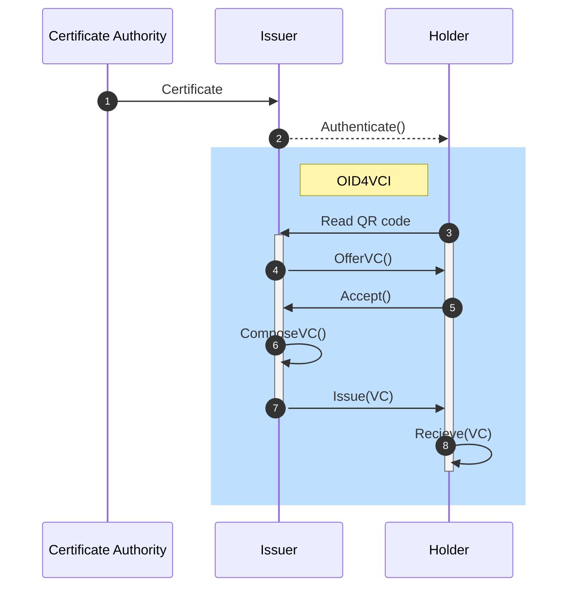

1. Issuer Certificate - OV証明書の発行

    Issuerの信頼性を担保するため、認証局がX.509証明書を発行します。X.509証明書はVCを発行する際にx5cヘッダーに格納されます。

    OWND Projectにおいては、既存のX.509サーバー証明書のガバナンスに従って発行されるOV（Organization Validation）証明書を利用し、Issuerの実在性の担保を行っていますが、これに限らず、例えば日本においては、法務省が発行するX.509証明書を用いることも考えられます。

    将来的にはX.509に限らず、OpenID Federation 1.0 trust chainなどの技術の採用も検討し、Issuerのメタデータ（ISMS取得企業である等）の検証もできるように発展させていくことも考えられます。

1. Authenticate() - IssuerによるHolderの認証

    IssuerがVCを発行する主体であるHolderを認証し、VCの発行に必要なQRコードをHolderに提示します。
    OWND Projectでは、現状においてIssuerによるHolderの認証方法については検討の対象としていないため、例えば社員証を発行する際にHolderが社員であることをどのように認証するかについては、言及していません。

1. READ QR code - HolderによるQRコードの読み取り

    HolderがWalletを用いてQRコードを読み取ります。この際、Walletを起動せず、カメラアプリ等からQRコードを読み取ることも可能であるが、QRコードから生成されるCredential Offerは "openid-credential-offer://" というスキーマで表現されるため、Walletを指定することが出来ず、"openid-credential-offer://"に対応した複数のWalletを保有している場合には目的のWalletにVCが発行されない可能性があります。

    Androidにおいては、OSの機能としてWalletを選択するUIを備えている場合もありますが、iOSにおいてはどのWalletが選択されるかは指定することはできず、目的のWallet以外の"openid-credential-offer://"に対応したアプリケーションは端末から削除する必要があります。

1. Offer VC() - IssuerによるVCの発行オファー

    IssuerがQRコードを読み取ったHolderに対してVCの発行オファーを送信します。
    この際にHolderは識別子として、端末内に保持する秘密鍵に紐づく公開鍵が得られる識別子（公開鍵そのものやハッシュ化したもの、その他各種DIDをHolderが考えられる）を生成し、Issuerに提示する。

1. Accept() - HolderによるVC発行の承認

    OWND Walletでは、VC発行前に、CA、Issuer、Issuerのプライバシーポリシー、発行する目的、発行する情報の項目をWallet内でHolderに対し提示するように構成しているが、VC発行前にこれらの項目をHolderに対して提示することは、技術的な仕様として標準化されているわけでは無いため、今後発行時におけるHolderに対する情報提示の在り方については議論が必要だと考えられます。

1. ComposeVC() - IssuerによるVCの生成

    IssuerはVCを生成します。この際にVCには、CAからIssuerに発行されたX.509証明書、Issuerの公開鍵、Holderの識別子、Holderの属性情報を含め、Issuerの保有する秘密鍵（X.509証明書の発行時に用いたもの）で署名を行います。

1. Issue(VC) - IssuerによるVCの発行

    Issuerは生成したVCをHolderのWalletに発行します。

1. Recieve(VC) - HolderによるVCの受領

    HolderはVCを受領し、Wallet内に格納します。

##### VPの提示（OID4VP）のシーケンス

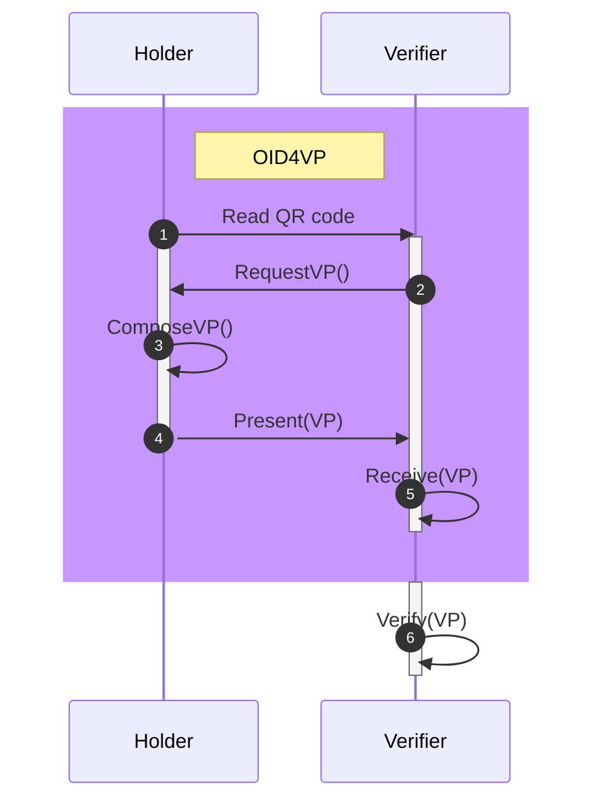

1. Read QR code - HolderによるQRコードの読み取り

    Holderは属性を提示したいVerifierの表示するQRをWalletで読み取ります。

1. RequestVP() - Verifierによる属性の要求

    Holderはどのような属性がどのような事業者から要求されているかを確認します。
    この際OWND Walletでは、提供する目的、提供する情報の項目をWallet内でHolderに対し提示するように構成しているが、これらの項目をHolderに対して提示することは、技術的な仕様として標準化されているわけでは無いため、今後情報提供時におけるHolderに対する情報提示の在り方については議論が必要だと考えられます。

1. ComposeVP() - HolderによるVPの生成

    上記要求を受け、Holderは利用する証明書の選択を行い、選択した証明書と属性情報、Holderの識別子を格納し、Holderの秘密鍵によって署名することによりVPを生成します。
    このとき、OWND Walletでは、Verifierの要求する項目が証明できる証明書が自動的に選択可能な証明書一覧に表示されるよう構成されていますが、Verifierの要求する項目の項目名と、Holderが保有する証明書の項目名が一致している必要があります。現状OID4VPにおいては項目名についての標準化は行われていないため、今後ユースケースごとにスキーマや項目名の標準化が必要になってくると考えられます。

1. Present(VP) - HolderによるVPの提示

    OWND Walletでは、VPを提示する際に、提供される情報の項目だけでなく、上記で選択された証明書に含まれるが、提供されない情報の項目も提示するように構成し、また、提供先のアプリケーション名や提供先事業者名、提供先事業者のOV証明書の内容、プライバシーポリシー等を表示することで、誰に何が提供され、何が提供されないかが分かりやすいように表示しています。
    これらの提供時に表示する情報についても標準化は行われていないため、今後VPに情報を提供する際にHolderにどのような情報を提示すべきかについては議論が必要です。

1. Receive(VP) - VerifierによるVPの受領

    VerifierはHolderからVPを受け取ります。

1. Verify(VP) - VerifierによるVPの検証

    VerifierはHolderの公開鍵を用いたVPの署名検証、Issuerの公開鍵を用いたVCの署名検証、VCのx5cヘッダーに含まれるX.509証明書の検証を行います。

#### 7.2.2 Self-Issued OpenID Provider v2（SIOPv2）を用いたアカウント作成

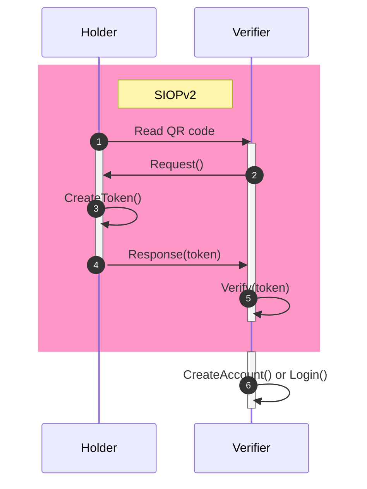

1. Read QR code - HolderによるQRコードの読み取り

    Holderはアカウントを作成したいVerifier（サービスプロバイダ）の表示するQRをWalletで読み取ります。

1. Request() - Verifierによる認証の要求

    Holderはどのような事業者から認証が要求されているかを確認します。
    この際OWND Walletでは、提供する目的、提供する情報の項目をWallet内でHolderに対し提示するように構成しているが、これらの項目をHolderに対して提示することは、技術的な仕様として標準化されているわけでは無いため、今後認証時におけるHolderに対する情報提示の在り方については議論が必要だと考えられます。

1. CreateToken() - HolderによるIDトークンの生成

    上記要求を受け、HolderはVerifierに提供する識別子を生成し秘密鍵で署名することにより、IDトークンを生成します。
    このとき、OWND Walletでは、提供する識別子による事業者間での名寄せを行えないようにするため、Verifier毎に異なった識別子（JWK Thumprint）を生成している。
    7.2.1 Verifiable Credentials を用いた属性証明 において利用しているHolderの識別子とは異なることに注意が必要です。

1. Respons(token) - HolderによるIDトークンの提示

    生成したIDトークンをVerifierに送信します。

1. Verify(token) - VerifierによるIDトークンの検証

    VerifierはHolderの公開鍵を用いた識別子および署名を検証します。

### 7.3 OWND Messenger のアーキテクチャ

##### 各エンティティの役割

* HomeServer（メッセージングサービス）

    メッセージングサービスを提供するためにHomeServerを運用する主体。サービス利用者のアカウントを発行し、必要に応じて利用者の属性を検証し、利用者間のメッセージを媒介する。

* Alice

    HomeServerにアカウントを作成し、属性を提供することにより、HomeServerにより属性の検証、メッセージの相手方（Bob）に対するメッセージの送信と属性の提示を行うメッセージングサービス利用者

* Bob

    HomeServerにアカウントを作成し、Aliceからメッセージリクエストを受け取り、Aliceの属性の確認とメッセージの受信を行うメッセージングサービス利用者

##### 現在 OWND Messenger で用いている技術（OSS）

* [Matrix protocol](https://github.com/matrix-org)

    Matrixプロトコルは、リアルタイムのコミュニケーションを実現するためのオープンソースのプロトコルです。MatrixはFederation型のネットワークを形成し、異なるサーバーやサービス間での相互運用を可能にします。これにより、ユーザーは異なるプラットフォームやアプリケーションを跨いでコミュニケーションを取ることができます。

    また、エンドツーエンドの暗号化をサポートしており、プライバシーとセキュリティを重視しています。

    OWND Messengerでは、Matrixプロトコルをベースにメッセージングアプリケーションを構築しています。

* [synapse](https://github.com/element-hq/synapse)

    Matrixプロトコルを利用するための、サーバー側実装（HomeServer）のオープンソースソフトウェアです。

    OWND Messengerでは、synapseにSIOPv2でのアカウント作成機能、OID4VPでユーザー属性をやりとりする機能を追加しています。

* [element-web](https://github.com/element-hq/element-web)

    Matrixプロトコルを利用するための、クライアント側実装（PCのみ）のオープンソースソフトウェアです。

    OWND Messengerでは、element-webにSIOPv2でのアカウント作成機能、OID4VPでユーザー属性をやりとりする機能を追加しています。

その他、OWND Walletとのデータのやりとりに用いられるSIOPv2やOID4VP等の技術についてもVerifier側の実装としてOWND Messengerでも利用していますが、OWND Wallet側で説明しているため、こちらでは割愛いたします。

##### OWND Messengerで用いられる秘密鍵

Matrixでは以下の鍵が各用途ごとに生成・利用されています。
鍵の詳細な仕様についてはMatrix protocolの仕様をご確認ください。

* マスター鍵（MSK : USKとSSKに署名する
* 自己署名鍵（SSK） : 自身のデバイス鍵に署名する
* ユーザー署名鍵（USK） : 他ユーザのMSKに署名する
* デバイス鍵 : 一時鍵に署名する
* 一時鍵 : 一度使用後は、ホームサーバーから削除する
* 予備鍵 : 一時鍵が尽きた場合に使用

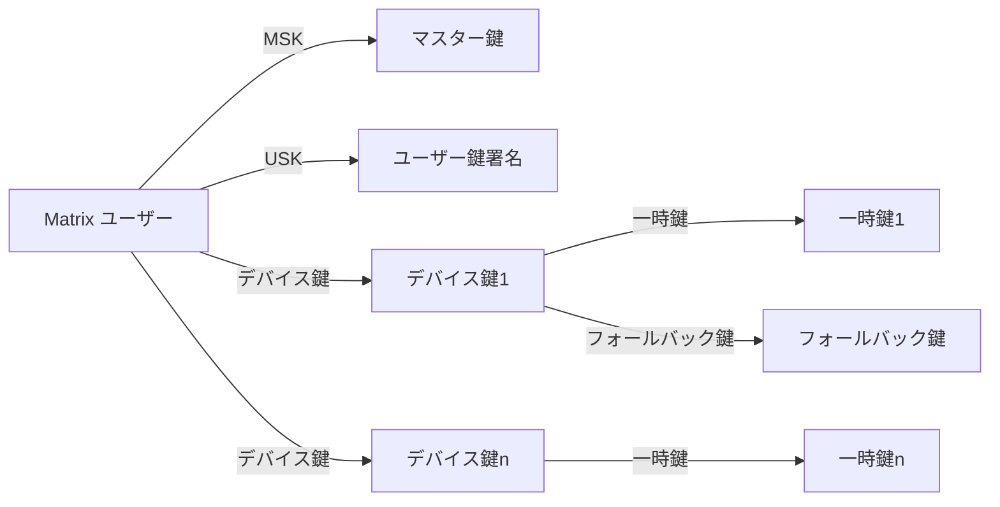

#### 7.3.1 OWND Messengerを用いたメッセージのやりとり

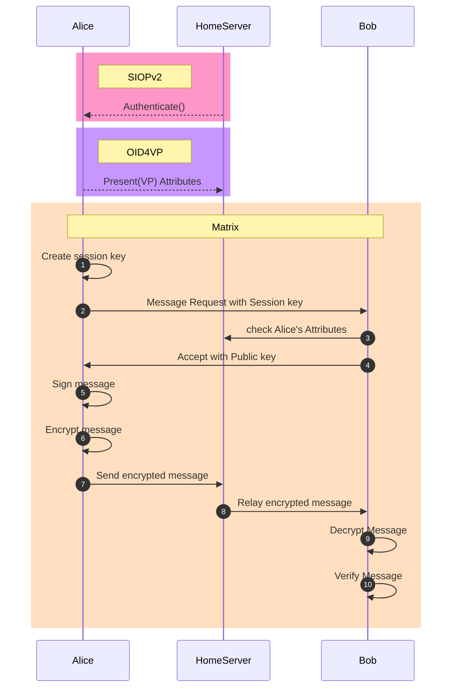
AliceはSIOPv2によりHomeServerにアカウントを作成し、OID4VPによりHomeServerに対して属性情報の提供を行っていることを前提としています。

### 7.4 Trusted Web アーキテクチャとの関係

TBD

## 8. ロードマップとマイルストーン

### 8.1 開発フェーズ

2024年3月までは、OWND Project事務局メンバーによる開発を行い、ユースケース実証を経た後にオープンソース化を行います。
この期間は初期開発のため、ソースコードは一般には公開されない状態ですが、OWND Project Monthly Meeting において、開発進捗やユースケースに対する実装方法の議論などはオープンに行われます。

2024年3月からは、ソースコードを一般に公開し、事務局メンバーだけでなく、プロジェクトメンバーを巻き込んだ開発のフェーズに移行します。

### 8.2 マイルストーンとタイムライン

| タイムライン | マイルストーン| マイルストーン達成に向けて実施すること|
|--|--|--|
| 2024年02月 | 実証実験 | ユースケースの実証実験の実施 |
| 2024年03月 | オープンソース化 | OWND Wallet, OWND Messengerのオープンソース化 プロジェクトメンバーによる継続的なアップデート開始 汎用ウォレットをベースに用いた、営利企業によるウォレットの提供 |
| 2024年05月 | OWND Messenger 運用ノード募集開始 | メッセージングサービスのベータ版リリース 参画・運用ルールを整備し、運用ノード募集開始 |
| 2024年07月 | 汎用ウォレットを用いたユースケースの募集 | コミュニティによる汎用ウォレットを用いた他ユースケースの募集 |
| 2024年12月 | 汎用ウォレットをベースとした複数アプリケーションでの相互運用性の確認 | ユースケースの応じたデータの標準化を検討し、ウォレットアプリの相互運用性を確認 |
| 2024年04月 | OWND Messenger 運用ノード増加 | メッセージング運用ノードを10ノードに拡大、利用者1万人を目指す |

## 9. ユースケース

### 9.1 年齢確認

マイナンバーカードを用いた認証（JPKI）により取得できる基本四情報から、基本四情報の証明および、生年月日から導出される、13歳以上であることの証明を含む証明書（SD-JWT VC）を発行し、SNSサービスプロバイダに対して、基本四情報を開示することなく、13歳以上であることを証明するユースケースです。

#### 9.1.1 各エンティティの役割

* Sectigo Limited - Certificate Authority
    
    IssuerであるOWND Project事務局（現在はDataSign）の実在性を確認し、`ownd-project.com`に対してOV証明書を発行します。

* xID

    マイナンバーカードを用いた認証（JPKI）により基本四情報を取得し、ユーザーの認可によりIssuerであるOWND Project事務局に基本四情報を提供します。

* OWND Project事務局（DataSign） - Issuer

    xIDから取得した基本四情報から、基本四情報の証明および、生年月日から導出される、13歳以上であることの証明を含む証明書（SD-JWT VC）をユーザーに対して発行します。

* ユーザー - Holder

    Issuerから証明書の発行を受け、Verifierに対して13歳以上の証明を行う主体です。

* SNSサービスプロバイダ（OWND Messenger） - Verifier

    Holderから13歳以上を示す証明書を受け取り、HolderおよびIssuerを検証し、Holderが13以上であることを確認した上で、サービスを提供する主体です。

#### 9.1.2 シーケンス

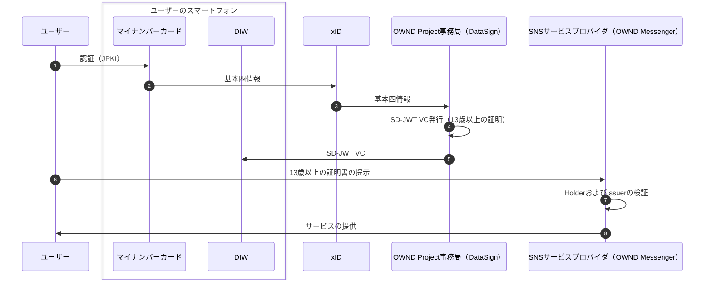

### 9.2 イベント参加証

イベント主催者がイベント参加証（JWT VC）を発行し、近隣の飲食店にイベント参加証を提示することにより、割引サービスを受けられるユースケースです。

#### 9.2.1 各エンティティの役割

* Sectigo Limited - Certificate Authority
    
    Issuerである一般社団法人Privacy by Design Labの実在性を確認し、`issuer.privacybydesign.jp`に対してOV証明書を発行します。

* 一般社団法人Privacy by Design Lab - Issuer

    Privacy by Design Conference 2024 に参加したことを証明する証明書（JWT VC）をイベント参加者に対して発行します。

* イベント参加者 - Holder

    Issuerからイベント参加証の発行を受け、Verifierに対してイベント参加の証明を行い、割引を受ける主体です。

* 近隣店舗（HANEDA SKY BREWING） - Verifier

    イベント参加証をイベント参加者から受け取り、HolderおよびIssuerを検証し、Holderがイベント参加者であることを確認した上で、割り引きサービスを提供する主体です。

#### 9.2.2 シーケンス

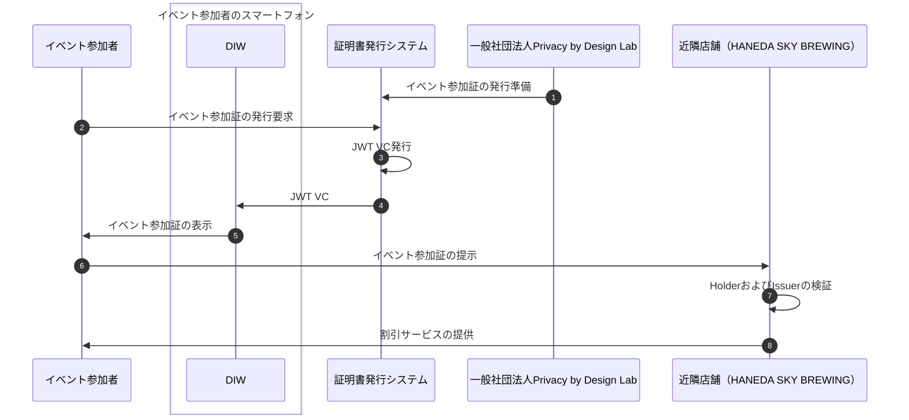

### 9.3 デジタル社員証

所属企業から社員証（SD-JWT VC）の発行を受けたユーザーが、OWND Messengerを介してメッセージの相手方に所属企業を提示することにより、メッセージの相手方がユーザーの所属企業を確認した上でメッセージを開始できるユースケースです。

#### 9.3.1 各エンティティの役割

* Sectigo Limited - Certificate Authority
    
    Issuerである株式会社DataSignの実在性を確認し、`datasign.jp`に対してOV証明書を発行します。

* 株式会社DataSign - Issuer

    株式会社DataSignに所属していることを証明する社員証（SD-JWT VC）を社員に対して発行します。

* 社員 - Holder

    Issuerから社員証の発行を受け、メッセージ受信者に対して所属組織の提示をおこなった上でメッセージを送信します。

* OWND Messenger - Verifier

    社員証をHolderから受け取り、HolderおよびIssuerを検証し、Holderが所属している組織名称をOWND MessengerのUI上で表示します。

* メッセージ受信者

    OWND Messenger上でHolderからメッセージリクエストを受け取り、Holderのプロフィール画面から所属組織を確認した上で、メッセージを受信します。

#### 9.3.2 シーケンス

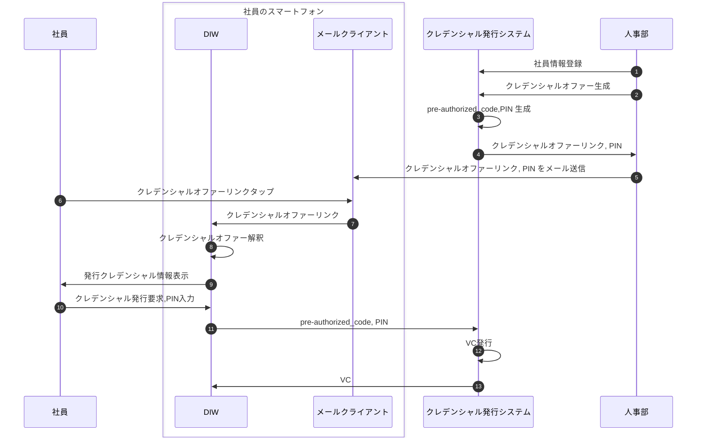

## 10. ビジネスモデルの検討

### 10.1 秘密鍵管理/バックアップ/同期サービス
デジタルアイデンティティウォレットにおいて、秘密鍵の管理は大きな課題のひとつです。現状のOWND Walletにおいては、アイデンティティを自分自身で管理するメリットと引き換えに、秘密鍵管理やバックアップは自己責任になるというトレードオフが発生しています。

OWND Walletでは、秘密鍵を各デバイスのセキュアエレメントに保存しており、端末自体を紛失した場合には、事前にバックアップを手動でおこなっていない限り、情報が失われてしまいます。

またバックアップデータに関しても、デバイスの紛失に対応する場合には、Google Drive等のオンラインストレージに保存することになり、設定ミス等によりデータが漏えいしてしまうリスクが発生します。

また、複数のデバイスでデジタルアイデンティティウォレットを用いる場合には、デバイス間でのデータの自動的な同期が行われる等、利便性についても考慮する必要があります。

暗号資産で用いられているウォレットも、ノンカストディアルウォレット（秘密鍵を利用者自身で管理する）の場合は同様の課題を抱えています。

有名なMt.Gox事件やCoincheck事件はいずれも、サーバに保管している秘密鍵に対して、第三者から不正なアクセスがあったことが原因です。そのため、暗号資産を安全に管理したい利用者は、秘密鍵を自分自身で管理するノンカストディウォレットに暗号資産を保管しておくことが一般的になりました。

暗号資産ウォレットで広く用いられているHD Wallet (Hierarchical Deterministic Wallet)は、12個のランダムな単語を秘密鍵生成のシードとして利用する方法を用いて復元することができるようにすることで、秘密鍵の管理の簡略化に取り組んでいますが、12単語を忘れないようにどこかに保管しておく必要は生じます。

ウォレット作成時に表示される12単語のスクリーンショットを保存したり、12単語をコピーしてメモ帳アプリに保管したり、紙に書き写したりすることで保管している方が多いですが、管理方法として適切であるとは言えません。

そのため、利用者が自分の信頼できる第三者に秘密鍵やバックアップデータの管理を委託することで、安全にこれらのデータを保管し、デバイス間同期などの利便性に対応するサービスをDIW提供事業者やその他の第三者が有料でDIW利用者に提供するビジネスが考えられます。

特にDIW提供事業者ではなく、その他の第三者（銀行などの信頼性が高い企業）が上記のようなビジネスを行うことで、安全性だけでなく、ウォレット間の相互運用性にも対応する利便性の高いサービスが提供できると期待されます。

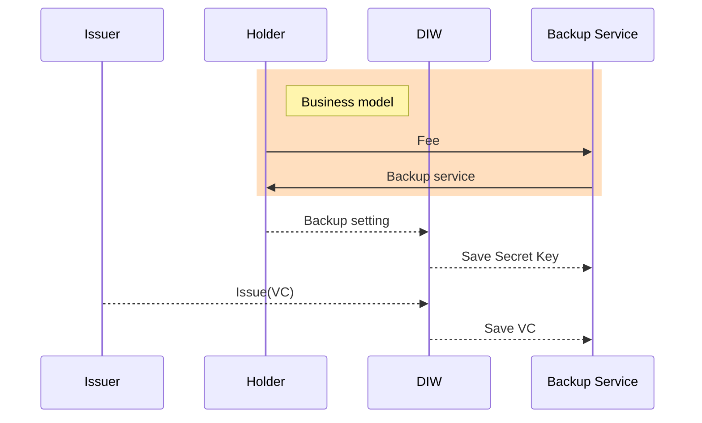

### 10.2 証明書発行インフラ提供

学生証や社員証、TOEICの点数証明、フィナンシャルプランナーの資格証明など、自身が保有する資格等を第三者に対して証明を行う必要がある場合には、学校や所属企業、検定事業者等が発行した、何らかの証明書を提示する必要があります。

現状においては、紙の証明書を提示することが多く、デジタルにおける証明や検証について課題があることは、現状の課題でも述べたとおりです。またこれらをデジタル化するデジタル証明書発行サービスも存在はしていますが、選択的開示には対応しておらず、例えば、TOEICのデジタル証明書には顔写真や生年月日なども記載されている、不要な情報まで提示先に渡すことになり、また、デジタル証明書はIssuerのサーバーにホストされており、本人によるコントローラビリティが確保されているとは言えず、デジタル証明書のIssuerが、証明書発行者ではなく、デジタル証明書発行サービスになっていることや、Issuer自体を検証できないことなどにより、ガバナンスに関して課題が存在しています。

OWND Projectにおいては、Issuer自身の検証を行えるようX.509証明書を用いたIssuer自身の検証にも対応し、また、選択的開示にも対応することにより、上記の課題を解決したシステムをIssuerに対して提供できるよう構成しています。これらのシステムをIssuer自身がサーバを構築し運用することも可能ですが、学校や所属企業、検定事業者等のIssuer自身がそれらのシステムを構築運用し続けることは難しいため、証明書発行システムの構築運用を行うサービスをSIerやホスティング事業者等が提供することが期待されます。

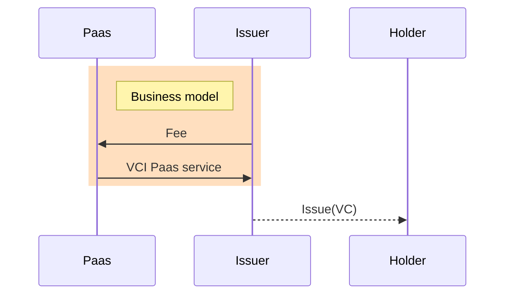

### 10.3 メッセージングインフラ提供

OWND Messengerでは、特定の事業者に依存しているSlack等の企業向けメッセージングツールを代替するものとして、Matrixプロトコルに対応した相互運用可能なメッセージングアプリケーションをオープンソースで公開します。
これらのコードを利用し、各社が自社のメッセージングサーバを構築し、企業間でのメッセージのやりとりを、特定の事業者に依存せず、End-to-End暗号化された環境で行うことで、課題の解決を行うことができます。

しかしながら、メールサーバにおいても、メールサーバを自社で独自に構築し運用しているケースはほとんど存在しておらず、メールサーバのPaasやGoogle WorkspaceやOffice 365等のSaasを利用し、その構築運用を委託しているケースがほとんどです。

Eメールのケースと同様、メッセージングサーバについても、Home ServerのPaasやSaasを提供するサービスがSIerやホスティング事業者等から提供されることが期待されます。

10.2の証明書発行インフラ提供サービスを組み合わせることで、企業間での所属証明等も可能なメッセージング環境を構築することが可能となります。

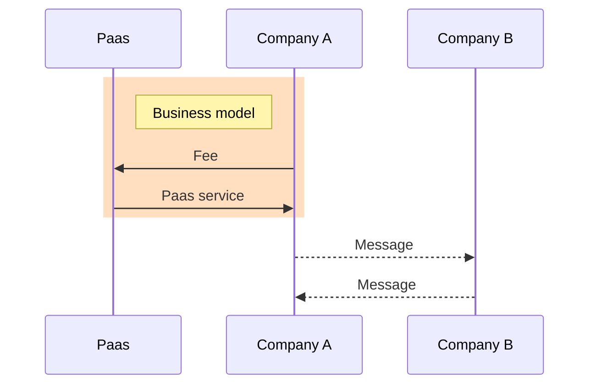

## 11. 結論と参加への呼びかけ
### 11.1 ホワイトペーパーの要約
OWND Projectは、個人が自らのアイデンティティを管理し、属性情報を他者と相互検証できるようにすることで、特定のサービスに依存しないデータやメッセージのやりとりの実現を目指しています。これによりオンラインでのトラストが向上し、個人や法人がより自由かつ安全にオンラインでコミュニケーションをとることができるようになります。

オープンソースソフトウェアの開発、トラストを担保するガバナンスモデルの検討、ユースケースおよびビジネスモデルの探求を通じて、新たなデジタルアイデンティティとコミュニケーションの標準を確立し、社会への実装を実現します。

本プロジェクトは、透明性を重視し、誰もが自由に参加し、貢献できるオープンなコミュニティを目指しています。

### 11.2 プロジェクトへの参加への呼びかけ
このホワイトペーパーでは、OWND Projectの理念、ガバナンス、技術的なアーキテクチャ、ユースケース、考えられるビジネスモデルなどについて述べてきましたが、理想を実現するためには多くの課題が残されていることも事実です。

OWND Projectは、これらの課題を解決し、デジタルアイデンティティとコミュニケーションの未来を共に実現する仲間を求めています。あなたの専門知識、技術、情熱が、より信頼できるデジタル社会の実現に貢献できます。プロジェクトへの参加は、オープンソースソフトウェアの開発、ガバナンスモデルの策定、ユースケースの提案、ビジネスモデルの開発など、さまざまな形で可能です。また、コミュニティ内での意見交換やディスカッションを通じて、プロジェクトの方向性に影響を与えることもできます。

あなたが技術者であれ、研究者であれ、ビジネスプロフェッショナルであれ、OWND Projectはあなたの参加やプロジェクトへの貢献を歓迎します。

毎月行っている[OWND Project Monthly Meeting](https://github.com/OWND-Project/contributing/wiki)に参加し、情報収集を行うことからはじめてみませんか？

OWND Projectへの参加に興味がある方は、OWND Projectの[contributing](https://github.com/OWND-Project/contributing)リポジトリを確認し、参加方法やコミュニティの活動についての詳細をご確認ください。一緒に、デジタルアイデンティティとコミュニケーションの未来を形作りましょう。

